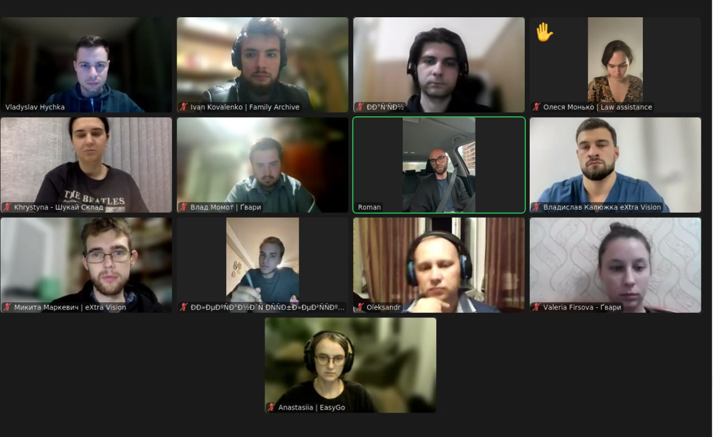

# 2023.11.15 - Підготовка до зустрічі

## Як виникла ідея

Я випадково відформатував диск з усіма сімейними фотографіями батьків, коли намагався організувати їх по папках (зібрати з усіх різних місць в одне).&#x20;

Тоді я подумав що класно було б мати бекап.&#x20;

## Яку можливість я бачу

Вважаю що AWS Glacier недооцінена технологія, складна в використанні. Кількість фото постійно зростає і ми не бажаємо просто так їх видаляти, бо це спогади. Отже найоптимальнішим варіантом було б архівувати ці фото.

## Чи це реальна проблема

З 5-ти інтерв'ю я побачив що люди користуються Google Drive або Google Photos. Користуються або автоматичним бекапом, або раз на \~3 місяці скидують усі фото. Ціна задовільняє. За останній рік жодного разу не переглянули минулі фото.

## В чому перевага від Google Drive/Google Photos

Менша ціна. End-to-end encryption. Додаткова функція авто сортування.

## Варіанти

### Зберігання фото для сімей

<figure><figcaption>
Lean canvas for families
</figcaption></figure>

### Програма для автоматичного 3-2-1 бекапа (Звузити авдиторію)

<figure><figcaption>
Lean canvas for geeks
</figcaption></figure>

### Сервіс для архівування документів на довгий строк (Змінити на B2B)

<figure><figcaption>
Lean canvas for big companies
</figcaption></figure>

### API / вебсайт для архівування файлів (Розширити авдиторію)

<figure><figcaption>
Lean canvas for developers/people
</figcaption></figure>

